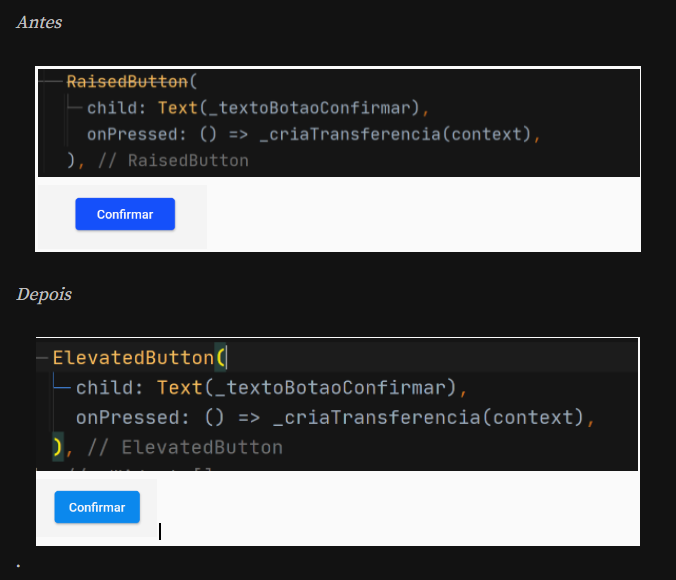

# Flutter Gerencimaneto de Estado
* Gerenciamento Estado e Provider
  * https://cursos.alura.com.br/course/flutter-gerenciamento-estados-provider
* Crie e valide formulários para aumentar conversões
  * https://cursos.alura.com.br/course/flutter-criacao-validacao-formularios-aumentar-conversoes
*  Firebase Crashlytics, gere relatórios de erro em tempo real
  * https://cursos.alura.com.br/course/flutter-firebase-crashlytics-relatorios-tempo-real
* Nuvigator: Controle de rotas e navegação
  * https://cursos.alura.com.br/course/flutter-nuvigator-controle-rotas-navegacao

## Novidades

### Com a Atualização do Flutter 2.0 em 2021, fizemos algumas alterações no nosso projeto!

* Os widgets RaisedButton e o FlatButton foram depreciados, e agora podemos usar um novo widget: o ElevatedButton.

*Mas qual é a diferença entre os dois?

* Com o ElevatedButton temos um novo Theme (cores, fontes, flutuação, movimento ao pressionar, cantos arredondados) e novas formas de estilizar usando o ButtonStyle.

* Também houve uma diferença no uso do List() que agora precisa ser substituído por [ ].

* Como por exemplo, anteriormente fazíamos List nomes = List(); e agora fazemos List nomes = [];
